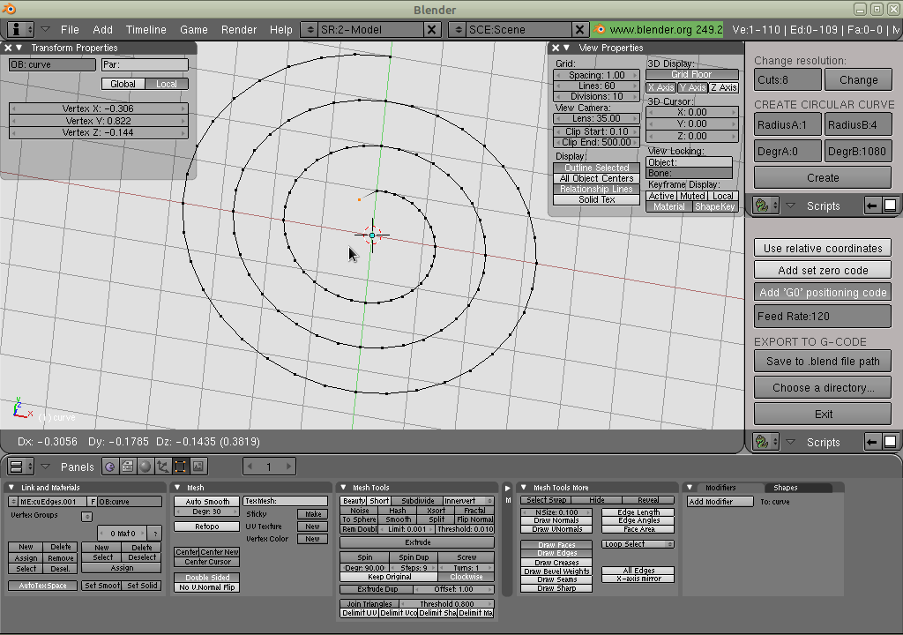

# blender249b-CAD
Computer aided design scripts for blender 2.49b.

Use create_circ_curve.py to create circlular curves and change their resolutions all at once with a click of a button.

Use reorder_vertex_line.py to reorder a mesh edge as if it were a path.

Use simple_ngc_export.py to export the reordered mesh edges to g-code.

Other scripts that might be useful are gnuplot2d_export.py and gnuplot3d_export.py which could be used for drafting.  
[https://github.com/lowlevel86/blender-to-gnuplot](https://github.com/lowlevel86/blender-to-gnuplot)  

CNC software:  
[https://github.com/lowlevel86/qclcnc](https://github.com/lowlevel86/qclcnc)

